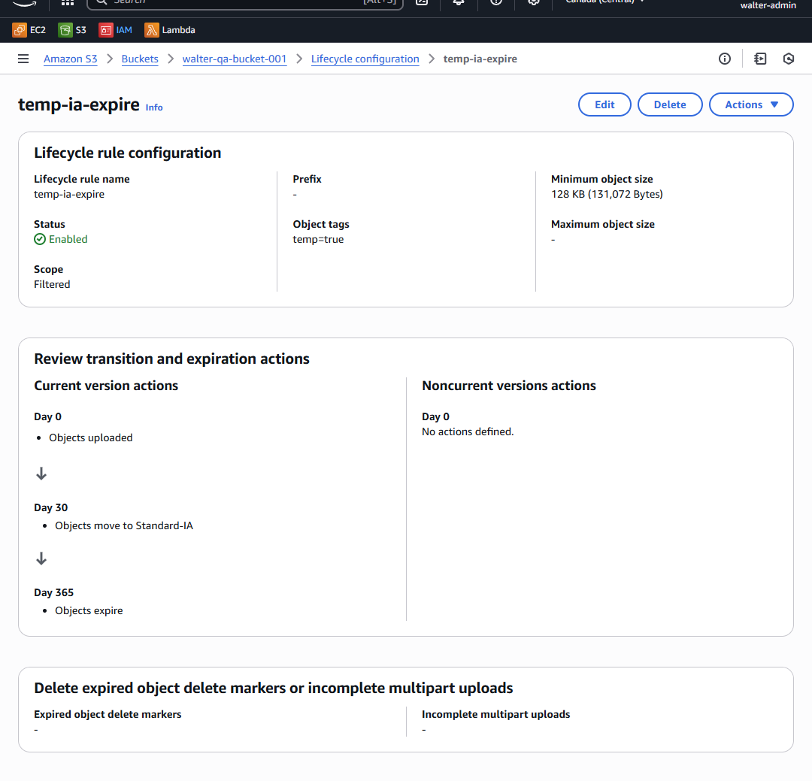
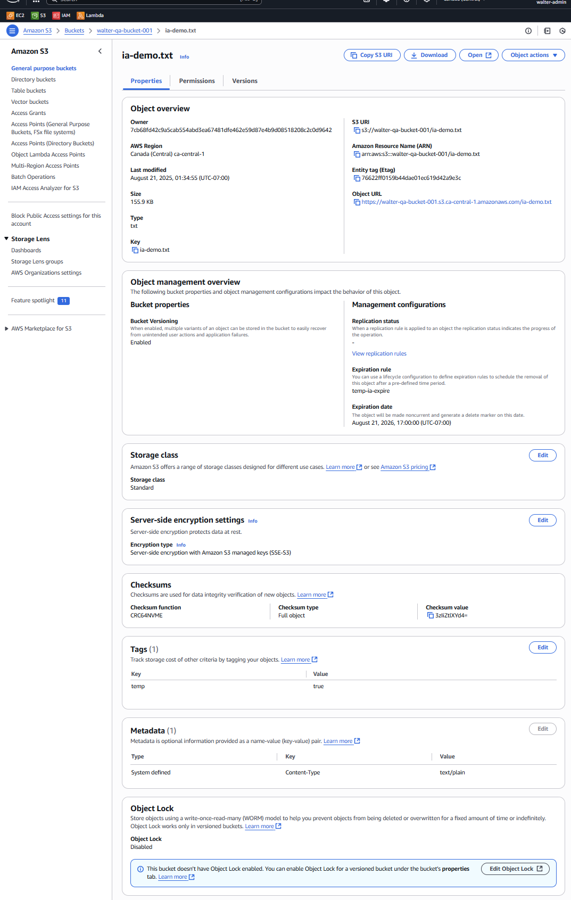
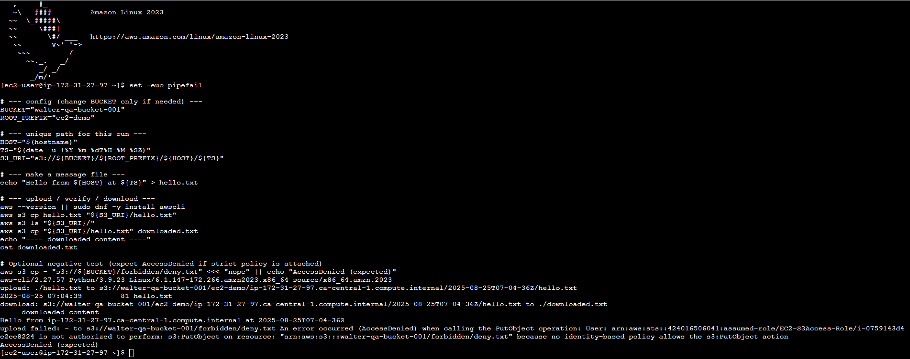
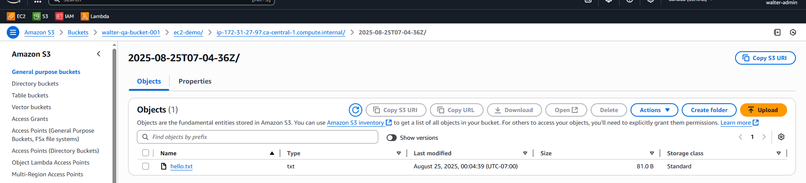

# EC2 → S3 Demo (Least-Privilege + Lifecycle)

**What this shows (1 paragraph):**  
Deployed an EC2 instance with an IAM instance profile that has **least-privilege** access to a single S3 bucket. I demonstrate a **bucket-scoped baseline policy** and a **prefix-scoped strict policy** (with TLS-only), plus an S3 **lifecycle rule** that targets objects tagged `temp=true` (transition to Intelligent-Tiering on Day 0; expire on Day 1). Terminal proofs include upload, download, and an expected `AccessDenied`. Console screenshots document the setup.

## Highlights


  



  


## Architecture at a glance
- **Bucket:** `walter-qa-bucket-001`  
- **EC2 Role / Instance Profile:** `EC2-S3Access-Role`  
- **Region:** `ca-central-1`

## Policies
- **Baseline:** [policies/03_bucket_policy.json](policies/03_bucket_policy.json)  
  Grants `s3:ListBucket` on the bucket and `Get/Put/DeleteObject` **only** within `walter-qa-bucket-001/*`.
- **Strict:** [policies/13_strict_policy.json](policies/13_strict_policy.json)  
  Scopes access to prefixes `ec2-demo/*` and `lifecycle-demo/*` **and** denies non-TLS (`aws:SecureTransport=false`).

### S3 Lifecycle: transition to IA + expire
- **Rule:** `temp-ia-expire`
- **Scope:** objects tagged `temp=true`
- **Actions:** Standard-IA @ 30 days; Expire @ 365 days
- **Min size:** 128 KB (recommended for IA)

## How I tested (from EC2)
```bash
# Positive (allowed) – baseline or strict (within allowed prefixes)
aws s3 ls s3://walter-qa-bucket-001/
echo ok | aws s3 cp - s3://walter-qa-bucket-001/ec2-demo/ok.txt
aws s3 ls s3://walter-qa-bucket-001/ec2-demo/

# Negative (expected AccessDenied under strict policy)
echo nope | aws s3 cp - s3://walter-qa-bucket-001/forbidden/deny.txt

## EC2 CLI basics (CloudShell): launch instance, get Public IP, list buckets

From CloudShell I automated:

1) Ensure a security group that allows SSH (22) in the default VPC.  
2) Fetch the latest Amazon Linux 2023 AMI.  
3) Find or launch an instance tagged `cli-ec2-demo`.  
4) Grab the instance `PublicIpAddress`.  
5) Verify S3 access with `aws s3 ls`.

**Screenshots**
- [EC2 CLI: launch + Public IP](screenshots/2025-08/17_ec2_cli_launch_public_ip.png)
- [S3 bucket list](screenshots/2025-08/18_cli_s3_list_buckets.png)

**Optional: SSH from your laptop**
```bash
chmod 400 /full/path/to/walter-ec2-key.pem
ssh -o StrictHostKeyChecking=accept-new -i /full/path/to/walter-ec2-key.pem ec2-user@<PUBLIC_IP>

### EC2 + IAM automation script
From the EC2 instance:
```bash
cat > ec2_iam_cp.sh <<'EOF'
# (script omitted here — see scripts/ec2_iam_cp.sh in this repo)
EOF
chmod +x ec2_iam_cp.sh
./ec2_iam_cp.sh

