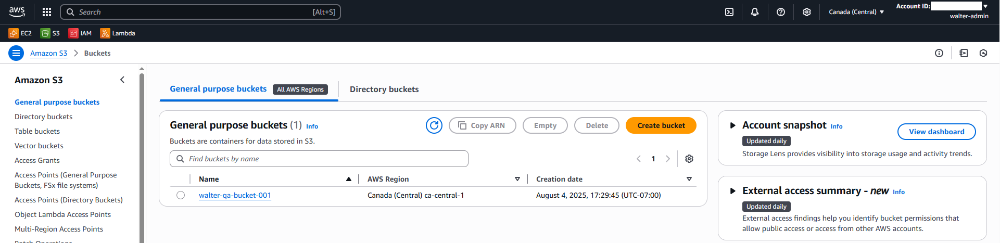
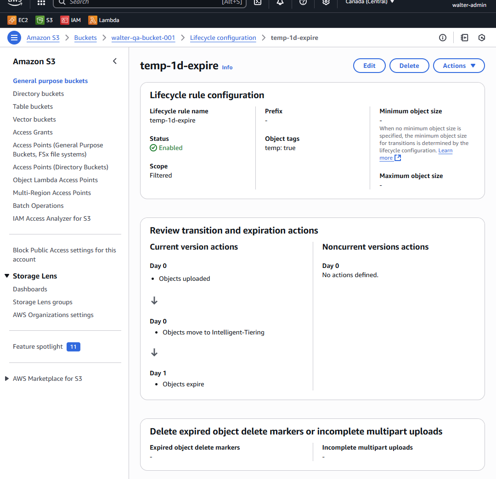
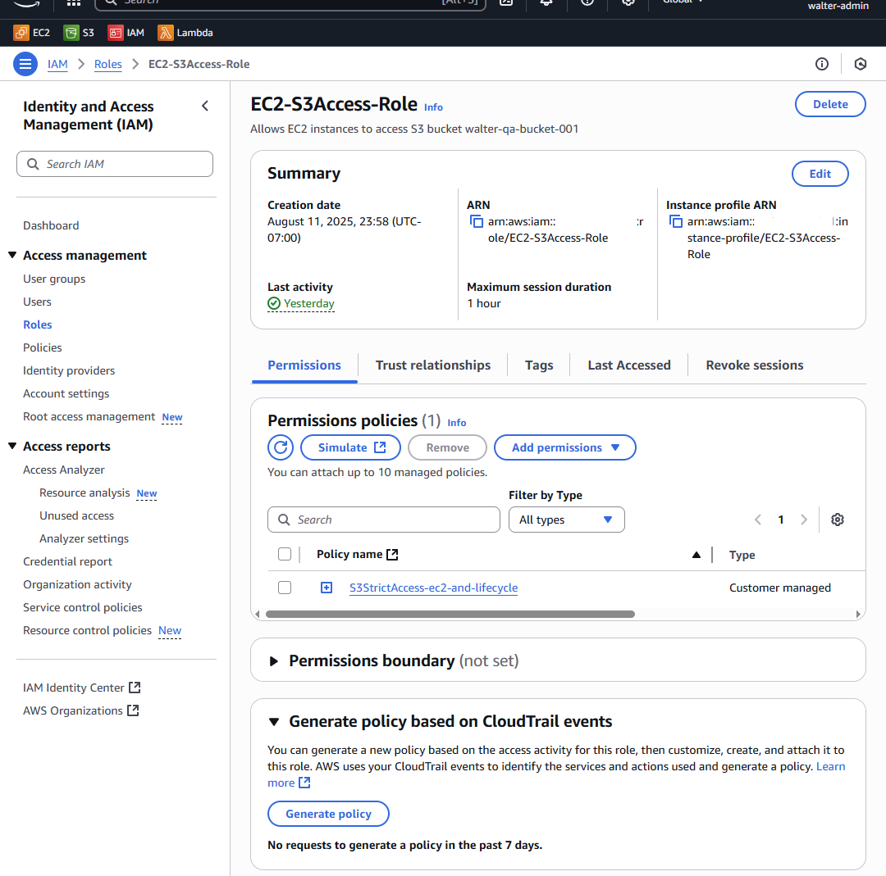
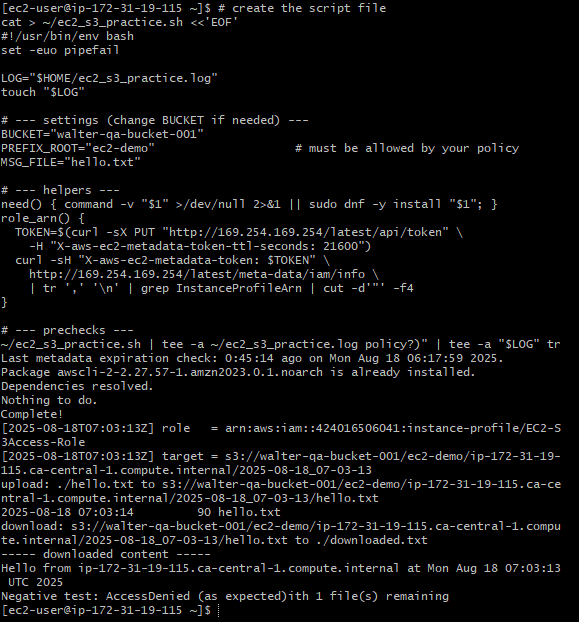
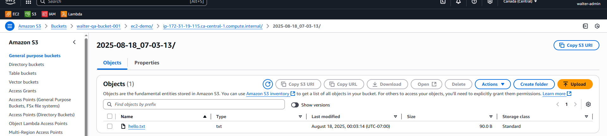

# EC2 → S3 Demo (Least-Privilege + Lifecycle)

**What this shows (1 paragraph):**  
Deployed an EC2 instance with an IAM instance profile that has **least-privilege** access to a single S3 bucket. I demonstrate a **bucket-scoped baseline policy** and a **prefix-scoped strict policy** (with TLS-only), plus an S3 **lifecycle rule** that targets objects tagged `temp=true` (transition to Intelligent-Tiering on Day 0; expire on Day 1). Terminal proofs include upload, download, and an expected `AccessDenied`. Console screenshots document the setup.

## Highlights







## Architecture at a glance
- **Bucket:** `walter-qa-bucket-001`  
- **EC2 Role / Instance Profile:** `EC2-S3Access-Role`  
- **Region:** `ca-central-1`

## Policies
- **Baseline:** [policies/03_bucket_policy.json](policies/03_bucket_policy.json)  
  Grants `s3:ListBucket` on the bucket and `Get/Put/DeleteObject` **only** within `walter-qa-bucket-001/*`.
- **Strict:** [policies/13_strict_policy.json](policies/13_strict_policy.json)  
  Scopes access to prefixes `ec2-demo/*` and `lifecycle-demo/*` **and** denies non-TLS (`aws:SecureTransport=false`).

## How I tested (from EC2)
```bash
# Positive (allowed) – baseline or strict (within allowed prefixes)
aws s3 ls s3://walter-qa-bucket-001/
echo ok | aws s3 cp - s3://walter-qa-bucket-001/ec2-demo/ok.txt
aws s3 ls s3://walter-qa-bucket-001/ec2-demo/

# Negative (expected AccessDenied under strict policy)
echo nope | aws s3 cp - s3://walter-qa-bucket-001/forbidden/deny.txt
